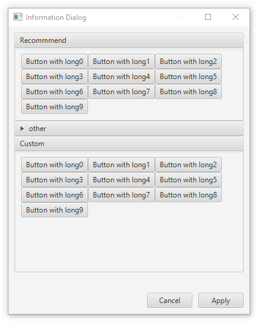

# javafxreproducer

To reproduce simply execute `./gradlew run` or to create a jlink application use `./gradlew jlinzip`

Alternatively, use the precompiled binaries from the [Java CI with Gradle check](https://github.com/Siedlerchr/javafxreproducer/actions/workflows/gradle.yml) workflow artifacts

## Screenshot

## Related Work

- [MyApp - JavaFX Demo Project](https://github.com/JulienTroudet/easyJavaFXSetup) - Demo project designed to provide a solid foundation for modern JavaFX applications. It includes all the essential configurations to simplify development, theme management, and multi-platform distribution.
